## Uh, hi, welcome to the gates of hell
### aka my notes about KILL la KILL -IF shader reverse engineering

This is basically a journal of all the things I've found out about shaders and stuff, so you don't have to dig through the web and search for all this info. I might miss some stuff, so if you're confused about anything do feel free to ping me in the modding chat of the klk if fan discord: https://discord.gg/rBDsfF3

First of all, in the ResourceWin folder of the klk if files we've got the shader folder, which will be our subject of analysis. In there we've got a lot of .cfx files with absolutely unintelligible names. Like wtf is this shit?

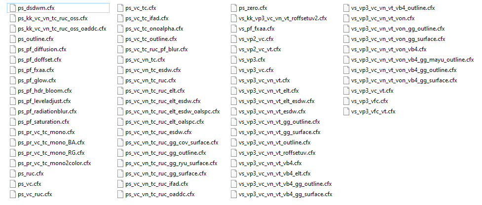

Searching the .cfx file format name yields nothing, as some other gas/liquid measurement software uses it, so the search is cluttered af with useless info. Opening any of these files with notepad++ shows that they have the DXBC prefix, let's search that.

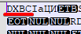

And bingo! DXBC stands for DirectX Bytecode, which is an intermediate representation of HLSL (High-Level Shading Language). HLSL is basically C on steroids, which makes it run stuff on tons of threads on the GPU, which is exactly what's needed for shaders. However, we can't just edit the DXBC files, as it is basically just bytecode, we need a way to convert them to HLSL (decompile), edit the said HLSL files, and convert them back to DXBC (recompile). A quich search yields us this git repository: https://github.com/etnlGD/HLSLDecompiler . We're gonna need this repo later, so download the latest release and read through its readme. Run this exe in cmd to see its available arguments:

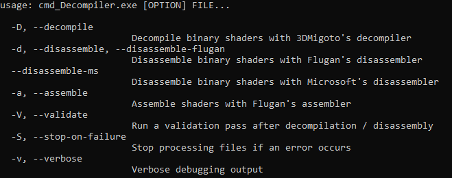

As you can see, this exe can decompile files, but it cannot recompile them back, so we're gonna need something to do exactly that. After some searching we can find the DirectX SDK (https://www.microsoft.com/en-us/download/details.aspx?id=6812), which contains the (sdk path)\Utilities\bin\x64\fxc.exe that can compile hlsl scripts to dxbc. Installation of the sdk might not go swimmingly tho, as you're gonna encounter at least the error S1023 (which can be solved by removing the Microsoft Visual C++ 2010 redist (both x64 and x86) (sauce: https://docs.microsoft.com/en-us/troubleshoot/windows/win32/s1023-error-when-you-install-directx-sdk)). Run `fxc /?` in cmd to see its arguments. It's a pretty long list (there's even a dedicated documentation page which explains all of them: https://docs.microsoft.com/en-us/windows/win32/direct3dtools/dx-graphics-tools-fxc-syntax), so I'll show you only the important bits. 

First off, the /T argument is required. It specifies the profile to use, which specifies both the shader version and its type:

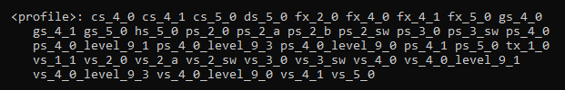

There's a lot of options here, but what we really need is the ps and vs profiles. ps stands for pixel shader, while vs stands for vertex shader. Btw, each klk if shader file has either the ps or vs prefix, so we're gonna focus exactly on those profiles. Even though we've excluded a bunch of profiles, there's still quite a few versions of these shaders, so we're gonna use scripts to check each version. We also need the /Fo argument to specify the object file output (which ends up being a DXBC file, exactly what we need). You can use bash, python or whatever other scripting languages to automate te process, I'm gonna use Dlang just because of the C-like syntax and easy way to multithread stuff. 

```d
module compileps;

import std.process;
import std.parallelism;
import std.file;
import std.stdio;

int main()
{
    foreach (filename; parallel(dirEntries(".", "*.cfx", SpanMode.shallow)))
    {
        auto result = executeShell("cmd_Decompiler.exe -D " ~ filename);

        if (result.status != 0)
            writeln(result.output);

        result = executeShell("fxc.exe /T vs_3_0 /Fo ../" ~ filename ~ " " ~ filename[0..$-4] ~ ".hlsl");

        if (result.status != 0)
            writeln(result.output);
    }

    return 0;
}
```

If you're interested in this programming language, take a look at its interactive tour: https://tour.dlang.org/

What this does is select each .cfx file in the same folder as the script, decompile and recompile it back with the given arguments (in parallel as well). Keep in mind that it recompiles the files into the directory a level higher than the one the script is in. That is because I've created pixelshader and vertexshader folders in the shader folder of the game, which contain a copy of each of the shaders (ps in the pixelshader folder and vs in the vertexshader one, do not mix them up!), which are used by the script for decompilation and also act as backups for whenever we need to revert the shader changes. The explanation might be a tad confusing, so there's an image of a working example:

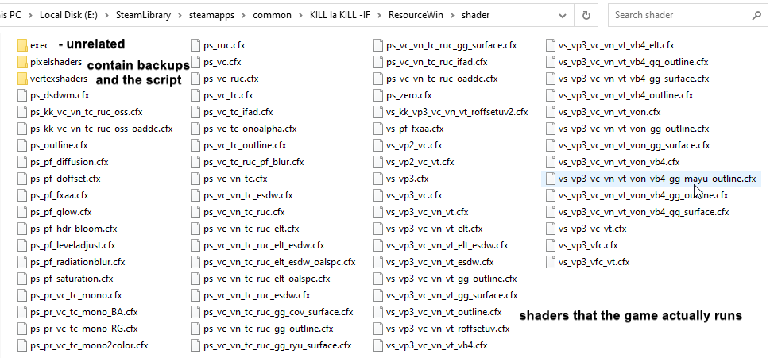

You can optimize the script even more by dividing the decompilation and recompilation in separate scripts, thus running the decompilation once and recompiling with each profile version, I just can't be arsed to do that.   

In the end I just edited the fxc profile argument to test each shader version. If there are no errors then the console will be empty and we can actually run the game to check for graphic artifacts. However, if there are any errors in the console then the recompilation process has failed, and we can surely say that the shaders won't run properly in the game.

These are the final results of the testing:

Pixel shaders:

- ps_5_0                : successful recompilation, graphics errors
- ps_4_1                : successful recompilation, graphics errors
- ps_4_0_level_9_0      : recompilation errors
- ps_4_0_level_9_3      : recompilation errors
- ps_4_0_level_9_1      : recompilation errors
- ps_4_0                : successful recompilation, graphics errors
- ps_3_sw               : recompilation errors
- ps_3_0                : recompilation errors
- ps_2_sw               : recompilation errors
- ps_2_b                : recompilation errors
- ps_2_a                : recompilation errors
- ps_2_0                : recompilation errors

Vertex shaders: 

- vs_5_0            : successful recompilation, no graphics errors noticed
- vs_4_1            : successful recompilation, no graphics errors noticed
- vs_4_0_level_9_0  : recompilation errors
- vs_4_0_level_9_3  : recompilation errors
- vs_4_0_level_9_1  : recompilation errors
- vs_4_0            : successful recompilation, no graphics errors noticed
- others            : recompilation errors

Pixel shader graphics errors:

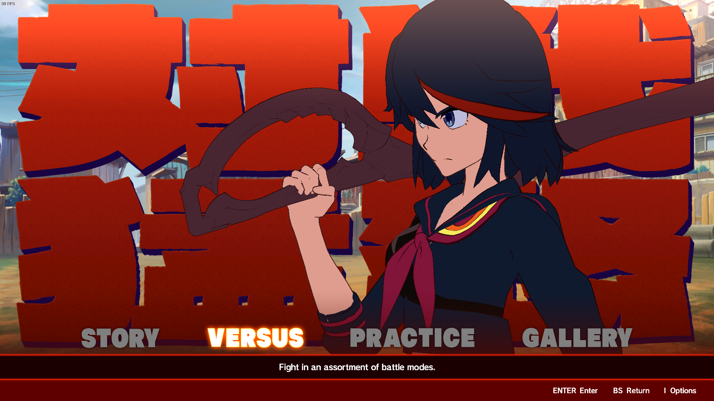

Vanilla look:

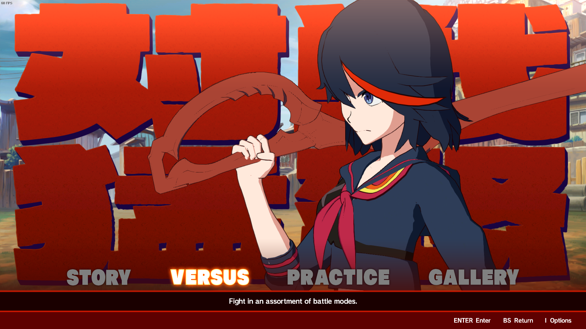

Both anti-aliasing and lighting is done via pixel shaders, and screwing with them straight up doesn't run these things.

As we can see, the only relatively successful shader versions are 5.0, 4.1 and 4.0. In the end we'll have to settle with a specific shader version, and because each newer shader version has higher requirements for the hardware than the older ones (no proof, just intuition), I suggest that we use the 4.0 version for the best compatibility with the players' hardware. 


We can also use RenderDoc to capture the rendering process and take a look at each rendering step. You can download it here: https://renderdoc.org/

In order to capture klk if, first we need to inject renderdoc into the game. Because klk if starts up with a launcher first, you cannot just use `File -> Launch application` to capture it (or at least I didn't manage to do that, you can probaly do so by tinkering with the parameters). What does work is injection into a running process. First, open `Tools -> Settings` and tick the `Enable process injection` checkbox, then restart.

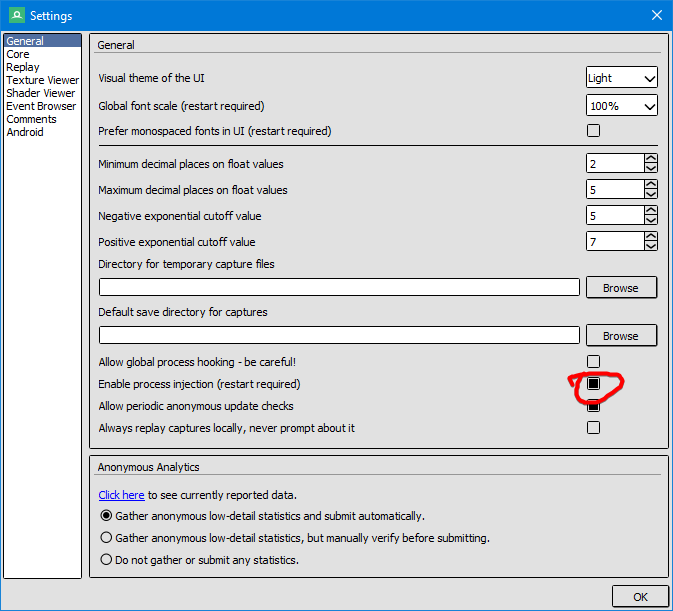

That opens up the `File -> Inject into Process` option. Select it and open up klk if (just the launcher for now), then select the klk if process in the `Inject into process` window. 

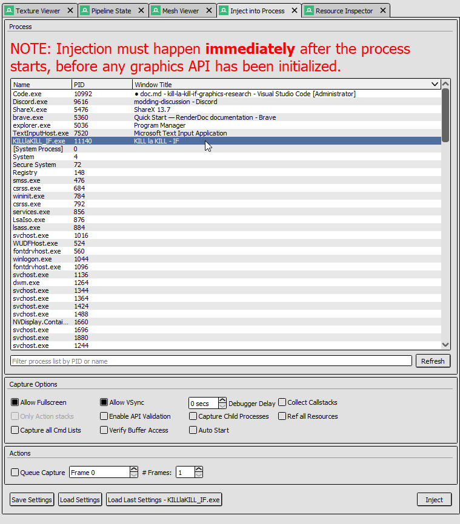

Open up the actual game and see if there is an overlay being rendered in the top-left corner. If it is, then the injection process has succeeded, and you can now capture frames to analyze. 

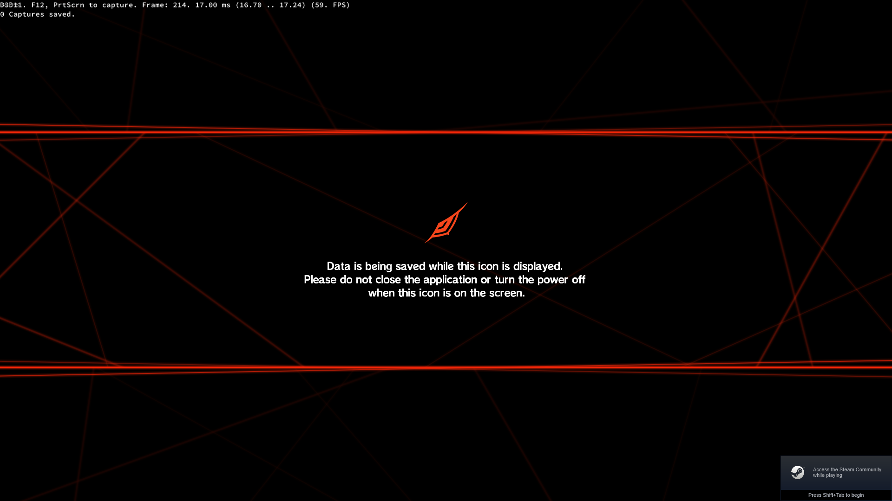

Unfortunately, the game does crash when entering any fight with RenderDoc injected, and I have no idea how to fix that. 

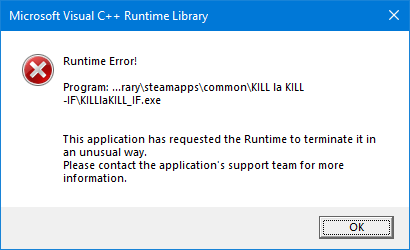

That is it for now, but I will add more info as I research more of this stuff.